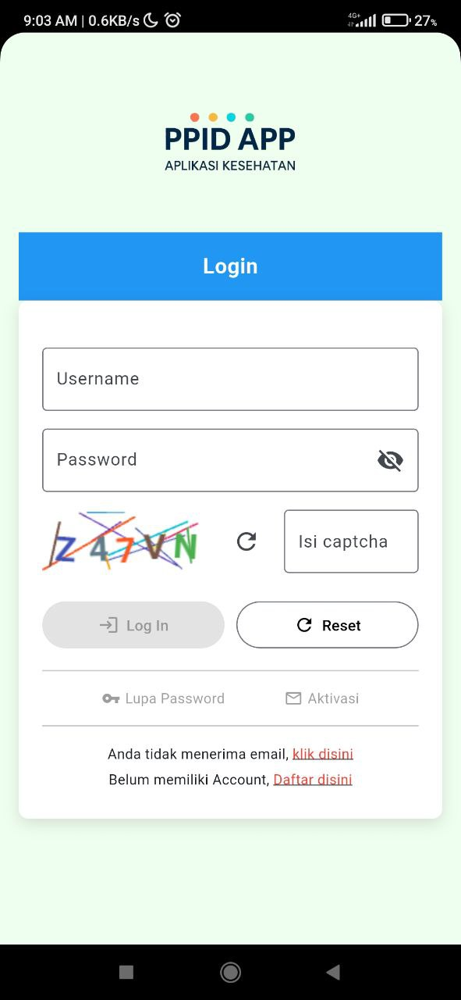
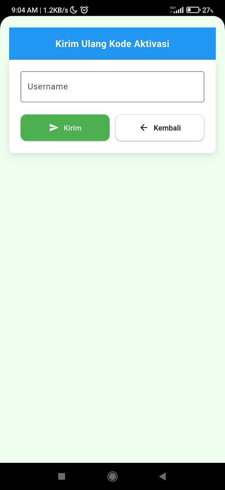
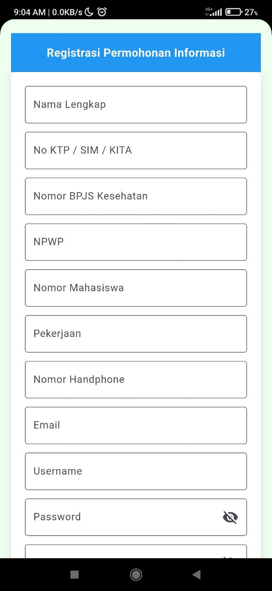
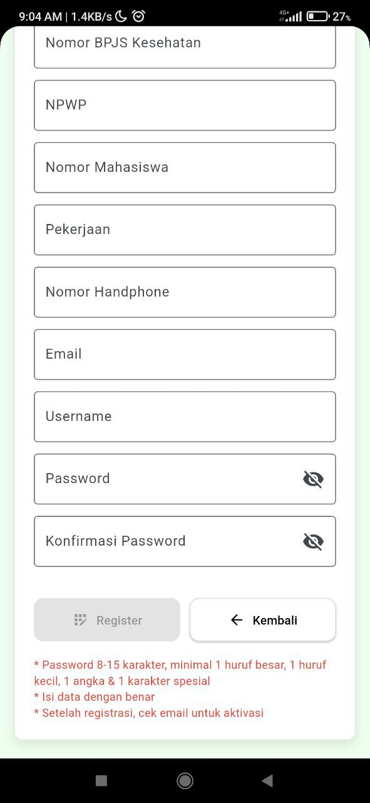
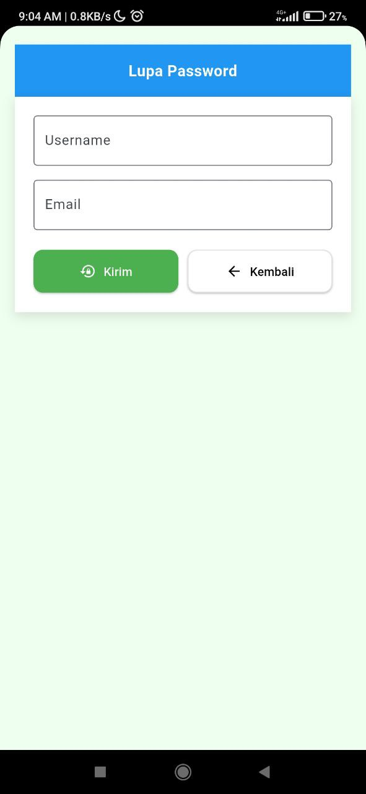

# 📌 PPID  

Tampilan antarmuka aplikasi **PPID**.  
Berikut beberapa screenshot fitur utama:  

---

## 🔑 Login, Aktivasi User, dan Aktivasi
<table>
  <tr>
    <td align="center"><b>Login</b></td>
    <td align="center"><b>Aktivasi User</b></td>
    <td align="center"><b>Aktivasi</b></td>
  </tr>
  <tr>
    <td></td>
    <td></td>
    <td></td>
  </tr>
</table>

---

## 📋 Daftar & 🔑 Lupa Password
<table>
  <tr>
    <td align="center"><b>Daftar</b></td>
    <td align="center"><b>Daftar (Step 2)</b></td>
    <td align="center"><b>Lupa Password</b></td>
  </tr>
  <tr>
    <td></td>
    <td></td>
    <td></td>
  </tr>
</table>
